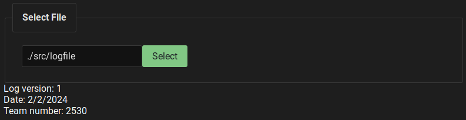

# DataTools2024

This is a tool for displaying information from log files collected with our 2024 robot. 

### Screenshots

As of 2/3  


### Development

#### Commands

```bash
# Make sure you have NPM and Cargo installed before running these

# To install rust
curl --proto '=https' --tlsv1.2 -sSf https://sh.rustup.rs | sh

# To install npm (using node version manager):
curl -o- https://raw.githubusercontent.com/nvm-sh/nvm/v0.39.7/install.sh | bash
source ~/.bashrc
nvm use v18.12.1

# Install all node project dependencies
npm install

# Start a dev server
npm run tauri dev
```

#### Suggested VS Code Plugins
- [Tauri](https://marketplace.visualstudio.com/items?itemName=tauri-apps.tauri-vscode)
- [rust-analyzer](https://marketplace.visualstudio.com/items?itemName=rust-lang.rust-analyzer)
